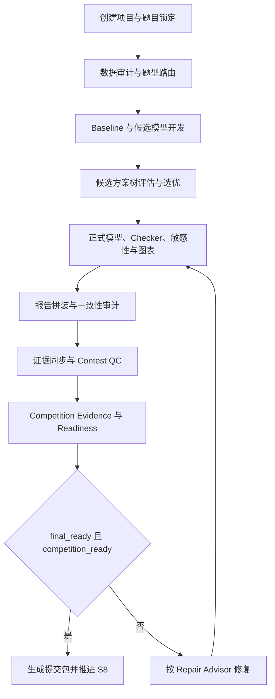

# Mathematical Modeling Agent

面向 CUMCM、MCM/ICM、校赛和课程建模任务的可验证工作流。它把题目解析、数据审计、baseline、核心模型、敏感性分析、报告审计、竞赛质控和最终提交包串成一套可执行的 S0-S8 流程。

## 能力

- 标准建模项目脚手架与 S0-S8 状态机。
- 优化、预测、评价、仿真、路径和统计题型路由。
- 真实数据 PoC、运行记录、结果、图表和论文主张追溯。
- 从项目产物非破坏性同步 Contest QC 待审核候选，减少比赛中手填台账。
- 报告与结果表、图表、数值和单位一致性审计。
- Contest QC 与 competition readiness 分层门禁。
- 离线确定性 Benchmark Harness，覆盖优化可行性、分组预测泄漏和评价排序稳定性。
- 有限深度 AIDE 式候选方案树，记录模型谱系、真实运行证据并确定性选优。
- manifest v2.0、SHA256 校验和原子化最终打包。

## 工作流总览



工作流分为三层：候选树负责保留和比较已经运行的模型实验；Pipeline 负责审计、证据、门禁和打包；Benchmark Harness 负责仓库能力回归，只有契约兼容时才作为候选评估器。三类状态不能混用：

| 状态 | 表示什么 | 不表示什么 |
|---|---|---|
| `selected` | 当前候选树中最强的合格实验 | 模型已被证明正确或可以提交 |
| `final_ready` | Contest QC 的证据、风险和合规门禁通过 | 已达到完整参赛评审口径 |
| `competition_ready` | 工程、模型、验证和论文资产达到最低可信参赛标准 | 保证获奖 |
| `S8 / completed` | 当前提交包和工程链路完整 | 数学结论必然正确 |

完整比赛顺序、阶段产物、Pipeline 精确步骤和失败回路见 [docs/competition-workflow.md](docs/competition-workflow.md)。

## 快速开始

```bash
python3 scripts/create_modeling_project.py "2026国赛项目" --base ~/Documents/数学建模
cd ~/Documents/数学建模/2026国赛项目
python 02_代码/17_contest_qc.py --phase early
```

早期只运行题目解析和模型骨架：

```bash
python 02_代码/08_pipeline.py --skeleton-only
```

终稿阶段完成 QC 台账后运行完整流程：

```bash
python 02_代码/18_contest_evidence_sync.py --dry-run
python 02_代码/08_pipeline.py \
  --strict \
  --strict-numbers \
  --strict-contest-qc \
  --strict-competition-readiness \
  --entry 02_代码/03_model_main.py \
  --zip
```

证据同步器只为小问、结果表和图表创建 `candidate` 行，并保留所有人工确认字段。文件存在不代表模型正确、结果有效、图表已审或达到 `paper_ready`；正式状态仍只能通过运行记录、数学核验和 Contest QC 人工/机器审查推进。

## 能力基准

仓库内置三个原创合成微型案例和九个参考提交，用于检查评分、硬阻断和证据契约是否发生回归。运行时不需要网络、API key、LLM 调用或额外 Python 依赖：

```bash
python3 scripts/modeling_benchmark.py validate --cases benchmarks/cases
python3 scripts/modeling_benchmark.py suite --fixtures benchmarks/fixtures
python3 scripts/modeling_benchmark.py run \
  --case benchmarks/cases/optimization_capacity \
  --submission benchmarks/fixtures/optimization_capacity/good \
  --output /tmp/modeling-benchmark-result
```

评分覆盖正确性、可行性、统计有效性、可复现性、证据一致性和效率。非零运行、输入哈希不符和不可信契约会判为 `invalid`；不可行解或明确数据泄漏会判为 `blocked`。Benchmark 分数不会写入或提升项目的 `competition_ready`，`strong` 也不代表能够获奖。

## 候选方案树

在正式题中保留 baseline 和改进分支，并从已经运行产生的项目内 submission 评估候选：

```bash
python 02_代码/19_candidate_solution_tree.py init \
  --objective-metric objective --direction maximize
python 02_代码/19_candidate_solution_tree.py add \
  --submission 08_候选方案/baseline \
  --label baseline --hypothesis "建立可复现基线"
python 02_代码/19_candidate_solution_tree.py evaluate --candidate C001
python 02_代码/19_candidate_solution_tree.py select
```

工具不会执行候选命令。只有退出成功、输入哈希一致、可行性与验证通过、证据哈希有效的节点才能参与选优；不同输入快照或不同 Benchmark case 的节点拒绝比较。`selected` 不会自动提升 Contest QC 或 `competition_ready`。详细契约见 [references/candidate-solution-tree.md](references/candidate-solution-tree.md)。

完整流程只有在 `final_ready` 和 `competition_ready` 均通过后才发布 `07_提交包` 并推进到有效 S8。开放 P0/P1、模板内容、项目外证据、失败 manifest、文件缺失或 SHA256 不一致都会阻断交付。

## 验证

```bash
python3 -m compileall -q scripts
python3 -m pytest -q
```

当前版本：`1.2.0`。`competition_ready` 表示工程、证据与论文资产达到最低可信参赛边界，不代表数学模型必然正确，也不保证获奖。

详细安装和工作流说明见 [INSTALL.md](INSTALL.md)、[docs/competition-workflow.md](docs/competition-workflow.md) 与 [SKILL.md](SKILL.md)。

## 协作

请通过 feature branch 或 fork 提交 pull request。GitHub 会在 Python 3.11 和 Python 3.13 上自动运行完整编译与测试，两个检查通过后才能合并到 `main`。

本地提交前运行：

```bash
python3 -m compileall -q scripts
python3 -m pytest -q
```

详细贡献要求见 [CONTRIBUTING.md](CONTRIBUTING.md)，安全问题与敏感材料报告方式见 [SECURITY.md](SECURITY.md)。GitHub 合并不会自动更新其他电脑上的 checkout，也不会自动覆盖 `~/.codex/skills/` 或 `~/.hermes/skills/` 中的安装副本。

## 来源与许可证

版权所有 (c) 2026 郑学君。

本项目是独立实现，工作流层面参考了公开研究项目 [usail-hkust/LLM-MM-Agent](https://github.com/usail-hkust/LLM-MM-Agent)，不包含其源码、数据集、提示词、模型权重或媒体资源。详细来源边界见 [NOTICE](NOTICE)。

本仓库内容采用 [MIT License](LICENSE) 发布。上游项目材料不适用本仓库的 MIT 授权，复制上游内容前应单独核对其许可证。
