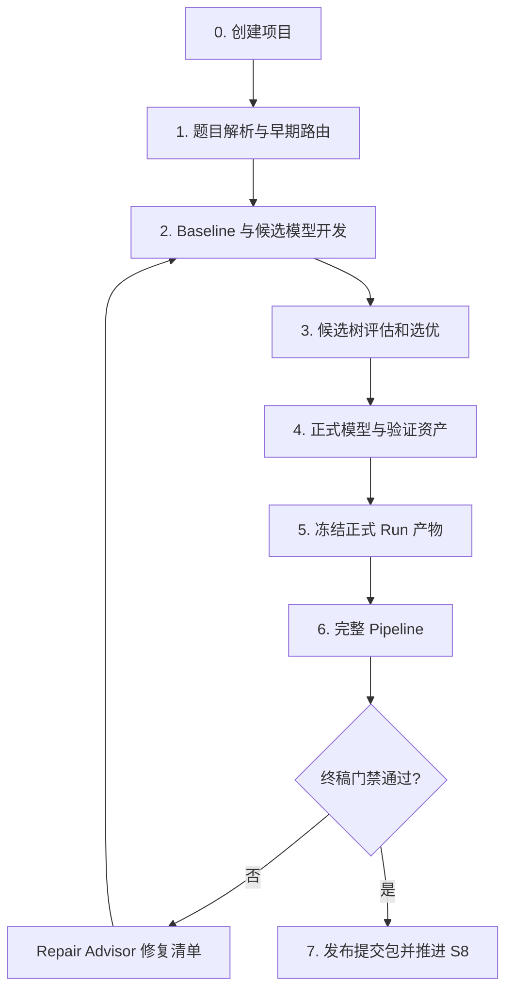

# 数学建模比赛端到端工作流

这份文档说明拿到赛题后如何使用 Mathematical Modeling Agent，从项目初始化推进到可审计的提交包。核心原则是：**先完成真实建模与候选比较，再由 Pipeline 做审计、门禁和打包。**

## 全流程



## 0. 创建项目并锁定题目

```bash
python3 scripts/create_modeling_project.py "2026国赛项目" --base ~/Documents/数学建模
cd ~/Documents/数学建模/2026国赛项目
python 02_代码/17_contest_qc.py --phase early --strict
```

先把题面、附件和规则放入 `00_题目与资料/`、`01_原始数据/`，再完善 `06_过程记录/problem_analysis.md`。每个小问必须写清目标、输入、输出、单位、约束和交付物，不能先写模型再反推题意。

主要产物：

- S0/S1 状态记录；
- `problem_analysis.md`；
- Contest QC 的交付物矩阵和早期登记表。

## 1. 数据审计与早期路由

```bash
python 02_代码/08_pipeline.py --skeleton-only --write-model-skeleton-code
```

早期模式运行数据审计、题型路由、模型骨架、领域 checker 模板和基础质量门禁。它用于确定可执行方向，不生成正式提交包，也不代表 `model_ready`。

主要产物：

- `03_结果表格/data_audit.csv`；
- `06_过程记录/model_skeleton/`；
- `06_过程记录/领域checker/`；
- `early_stage_passed` 或明确阻塞项。

## 2. 开发 Baseline 和候选模型

这一阶段是真正的建模生产环节。根据题型开发并真实运行：

```text
02_代码/01_preprocess.py
02_代码/02_baseline.py
02_代码/03_model_main.py
02_代码/04_sensitivity.py
02_代码/05_make_figures.py
```

必须保留输入哈希、参数、seed、运行命令、退出码、运行时间、结果表和图表。优化题要检查可行性与约束残差；预测题要防止数据泄漏并采用合理划分；评价题要检查指标方向、权重和稳定性。

**Pipeline 不会替团队自动完成这些模型脚本。** 完整 Pipeline 假设正式结果和报告资产已经存在，主要负责审计和交付控制。

## 3. 使用候选方案树选优

候选树是可选但推荐的模型探索层。每个候选放在 `08_候选方案/<name>/`，包含 `solution.json`、`run_record.json`、`report.md` 和证据文件。

```bash
python 02_代码/19_candidate_solution_tree.py init \
  --objective-metric objective \
  --direction maximize

python 02_代码/19_candidate_solution_tree.py add \
  --submission 08_候选方案/baseline \
  --label baseline \
  --hypothesis "建立可复现基线"

python 02_代码/19_candidate_solution_tree.py evaluate --candidate C001
python 02_代码/19_candidate_solution_tree.py select
```

只有运行成功、输入快照一致、可行性与验证通过、证据哈希有效且评估未过期的节点才能参与选优。Benchmark 只在候选与同一 case 契约兼容时加入比较。

`selected` 只表示当前有限树中的最佳合格实验。选中后仍需整理为题目特定正式模型并通过后续门禁。

## 4. 建立正式模型和验证资产

将选中的模型整理到正式代码、结果和报告目录，补齐：

- 题目特定变量、目标函数、约束和参数；
- 可运行求解器或训练/评价代码；
- 正式领域 checker，而不是带 TODO 的生成模板；
- baseline 或替代模型对比；
- 敏感性、鲁棒性、误差、不确定性或情景分析；
- 逐问结果表、正式图表和可复现 run；
- 报告中的直接结论、证据引用和局限性。

主模型完成后先运行模型阶段质控：

```bash
python 02_代码/17_contest_qc.py --phase model --strict
```

## 5. 冻结正式 Run 产物

当正式运行已完成、`run_record.csv` 已准确填写入口、输入、结果表和图表，且这些结果已经完成人工/机器审查后，冻结支撑论文证据的 run：

```bash
python 02_代码/17_contest_qc.py --freeze-run R1 --phase final --strict
```

将 `R1` 替换为真实 run_id；存在多个支撑 run 时逐个执行。completed run 必须有非空 `command`，并在 `input_files` 中列出输入/依赖；确实没有外部输入时显式填写 `not_applicable`。命令不会运行 `run_record.command`，只把项目内文件的相对路径、字节数和 SHA256 写入 `06_过程记录/竞赛质控/artifact_manifest.csv`。绝对路径、`..`、项目外 symlink、缺失文件和非 completed run 会被拒绝；并发冻结通过锁串行更新，旧清单不会被覆盖或半写入。

冻结只证明文件此后未变化，不证明模型正确。代码、输入、结果表或图表变化后，必须先重跑并重新审查正式结果，再显式冻结；不能在门禁中自动重算哈希，否则会把未审核改动静默合法化。

## 6. 运行完整 Pipeline

终稿阶段运行：

```bash
python 02_代码/08_pipeline.py \
  --strict \
  --strict-numbers \
  --strict-contest-qc \
  --strict-competition-readiness \
  --entry 02_代码/03_model_main.py \
  --zip
```

当前代码的实际执行顺序是：

```text
data_audit
→ model_skeleton
→ domain_checker_templates
→ quality_gate
→ quality_gate_plus
→ problem_coverage
→ result_interpretation
→ report_assembly
→ report_audit
→ state_update_pre_finalize
→ contest_evidence_sync
→ contest_qc
→ competition_evidence
→ repair_advisor
→ competition_readiness
→ finalize
→ state_update_final
```

其中 `contest_evidence_sync` 只创建待审核的 `candidate` 行，不能自动生成 `checked` 或 `paper_ready`。Pipeline 不会自动冻结或更新产物哈希；`contest_qc` 会核验支撑 paper-ready 证据的 run 是否已冻结且未漂移。最终打包只有在 Contest QC 为 `final_ready` 且 `competition_ready=true` 时才执行。

## 7. 理解四类状态

| 状态 | 责任边界 | 下一步 |
|---|---|---|
| `selected` | 候选实验比较 | 建立正式模型、checker 和验证资产 |
| `final_ready` | 交付物、运行、主张、图表、风险与合规证据 | 继续检查完整竞赛就绪度 |
| `competition_ready` | 工程、模型、验证、风险分析和论文资产 | 允许生成正式提交包 |
| `S8 / completed` | 本轮 finalizer 已发布通过 manifest 与校验和验证的当前包 | 人工检查最终文件并按官方渠道提交 |

这些状态都不等于保证数学结论正确或保证获奖。历史 S8 不代表本轮仍然通过；重跑被门禁阻断时，Pipeline 报告 `blocked` 且 `current_package_published=false`。

## 8. 失败后的修复回路

先看总控摘要：

```text
06_过程记录/pipeline/pipeline_run_summary.md
```

再看优先修复建议：

```text
06_过程记录/修复建议/repair_advice.md
```

修复时回到最早出现问题的阶段：题意或输入问题回到数据审计；模型与可行性问题回到候选开发；证据或报告问题回到正式资产；合规问题回到 Contest QC。不要通过跳过门禁或手工修改 readiness JSON 进入打包。

## 9. 比赛时间安排

推荐节奏：

| 时间 | 重点 |
|---|---|
| 0-8 小时 | 选题、题目锁定、数据审计、baseline、`workflow_ready` |
| 8-24 小时 | 候选模型、选优、正式 checker、`model_ready` |
| 24-48 小时 | 对比、敏感性、风险分析、图表和报告主体 |
| 48-72 小时 | Contest QC、交叉审计、`competition_ready` 和最终打包 |

更细的团队角色、交接和比赛节奏见 [competition-playbook.md](../references/competition-playbook.md)。组件级说明见 [pipeline-runner.md](../references/pipeline-runner.md)、[contest-quality-gate.md](../references/contest-quality-gate.md)、[competition-readiness-gate.md](../references/competition-readiness-gate.md) 和 [candidate-solution-tree.md](../references/candidate-solution-tree.md)。
